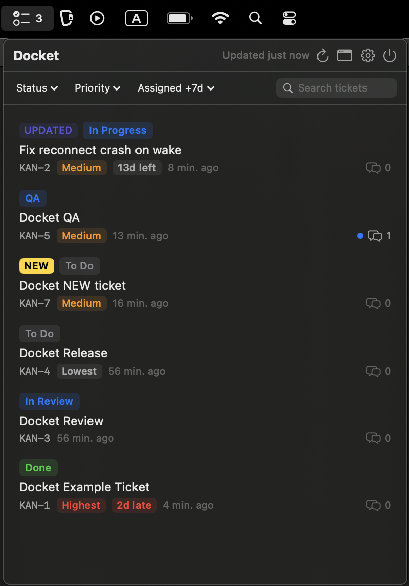
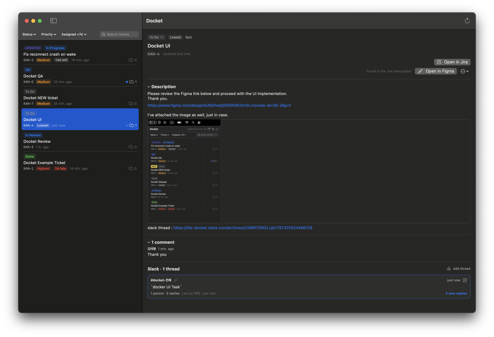

*한국어 · [English](README.en.md)*

# Docket

메뉴바에 상주하는 macOS 대시보드입니다. 나에게 할당된 Jira 티켓과, 그 티켓에 얽힌 Slack
스레드·PR·Figma·코멘트를 한 곳에서 보고, 상태 변경까지 그 자리에서 끝낼 수 있습니다.

빌드 없이 설치만 하려면 [INSTALL.md](INSTALL.md)([English](INSTALL.en.md))를 보세요.
라이선스는 [MIT](LICENSE)입니다.

<p align="center">
  
</p>




## 실행

[Tuist](https://tuist.dev)가 필요합니다(`brew install tuist` 또는 `mise install tuist`).

```bash
tuist generate          # Docket.xcworkspace 생성
open Docket.xcworkspace
```

Xcode에서 `Docket` 스킴을 Run 하세요. Dock 아이콘 없이 메뉴바에만 뜹니다(`LSUIElement`).
테스트는 `DocketKit` 스킴에서 ⌘U입니다.

Xcode의 Signing & Capabilities에서 **Team을 본인 계정으로 지정**해 두면 Keychain 접근
권한이 빌드마다 유지됩니다. 지정하지 않으면 ad-hoc 서명이라 재빌드 때마다 토큰 접근을
다시 허용해야 합니다.

## 설정

### Jira

1. https://id.atlassian.com → Security → **Create API token**
2. 앱 설정 → Jira 탭에 사이트 주소(`https://팀이름.atlassian.net`), 이메일, 토큰 입력
3. **연결 테스트**로 확인

### 표시할 티켓

설정 → 일반에서 고릅니다.

| 선택지 | JQL |
|---|---|
| 내게 할당된 미완료 *(기본)* | `assignee = currentUser() AND statusCategory != Done` |
| 내게 할당 · 최근 완료 7일 포함 | `assignee = currentUser() AND (statusCategory != Done OR resolutiondate >= -7d)` |
| 내가 보고한 미완료 | `reporter = currentUser() AND statusCategory != Done` |
| 워치 중 | `watcher = currentUser() AND statusCategory != Done` |
| 직접 입력 | 직접 쓴 JQL |

모두 `ORDER BY updated DESC`가 붙습니다. 프리셋을 고르면 실제 JQL이 아래에 표시되고,
직접 입력으로 넘어가면 그 JQL이 출발점으로 채워집니다. **질의 확인**은 결과 1건만 받아와
JQL이 유효한지 즉시 알려줍니다 — 오타로 대시보드가 조용히 비는 일을 막기 위해서입니다.

직접 입력이 비어 있으면 기본 프리셋으로 되돌아갑니다. 빈 JQL은 서버에 보내지 않습니다.

### GitHub

PR 버튼을 쓰려면 필요합니다. 넣지 않으면 그 부분만 비고 나머지는 정상 동작합니다.

1. github.com → Settings → Developer settings → **Personal access tokens**
   비공개 저장소를 읽으려면 `repo` 권한이 필요합니다.
2. 앱 설정 → GitHub 탭에 토큰과 저장소(`owner/repo`)를 넣고 **연결 테스트**

티켓 키가 **PR 제목이나 브랜치명**에 있으면 찾습니다. 지정한 저장소의 최근 PR 목록을
한 번 받아와 모든 티켓과 맞춰보는 방식이라, 토큰 권한도 그 저장소들로 한정됩니다.

### Slack

스레드는 **user token**으로 읽습니다 — 봇을 채널에 초대할 필요 없이 본인 권한
그대로입니다. 인증은 PKCE OAuth로 합니다 — client secret이 없으므로 백엔드도 필요
없습니다.

저장소에 기본 Slack 앱의 Client ID가 들어 있어 **대부분은 설정 → Slack 탭 → Slack
연결만 누르면 됩니다.** 

워크스페이스 정책이 그 앱을 막거나 직접 만든 앱을 쓰고 싶을때만 아래 절차를 따르세요.

1. https://api.slack.com/apps → **Create New App** → **From a manifest** →
   워크스페이스 선택 → `slack-app-manifest.yml` 붙여넣기.

2. **OAuth & Permissions**를 열어 아래 세 가지를 직접 확인합니다. 매니페스트가
   `redirect_urls`를 반영하지 못하는 경우가 있습니다.
   - **PKCE가 켜져 있는지.** 꺼져 있으면 Slack이 `http://localhost` 리다이렉트를 저장조차
     거부합니다. **먼저 PKCE를 켜고** 리다이렉트를 추가해야 합니다.
   - **Redirect URLs에 세 개가 모두 있는지.** 없으면 추가하고 **Save URLs**를 누릅니다.
     ```
     http://localhost:53682/slack/callback
     http://localhost:53683/slack/callback
     http://localhost:53684/slack/callback
     ```
   - **User Token Scopes 7개가 있는지.** 매니페스트가 `scopes`를 반영하지 못하는 경우가
     있습니다. `channels:history`, `groups:history`, `im:history`, `mpim:history`,
     `users:read`, `channels:read`, `groups:read`. 대화 종류별로 history 스코프가 따로
     필요합니다 — 없으면 그 스레드는 읽히지 않습니다. `search:read`는 더 이상 쓰지
     않습니다.

PKCE를 켜면 Slack은 `token_rotation_enabled`가 `false`여도 **항상 회전 토큰을
발급합니다**(문서는 커스텀 URI 스킴에 한정해 설명하지만 실제로는 PKCE 자체가
트리거입니다). 앱은 이를 전제로 동작합니다 — 약 12시간 수명의 토큰을 만료 5분 전에 자동
갱신하고, 그래도 거부되면 한 번 갱신한 뒤 재시도합니다. refresh token은 Keychain에
보관합니다.

Slack이 갱신에 `client_secret`을 요구하는 경우에만 Slack 탭 → **고급**에 입력하세요.
Keychain에만 저장되며 앱 바이너리에는 들어가지 않습니다.

3. **Basic Information → Client ID**를 `Project.swift`의 `SlackClientID`에 넣고
   `tuist generate` 후 재빌드합니다. Client ID는 비밀이 아닙니다.

4. Docket 설정 → Slack 탭 → **Slack 연결**. 브라우저에서 승인하면 끝납니다.

대시보드의 "Install to Workspace"는 누르지 마세요 — 4단계의 OAuth 흐름이 설치까지
합니다.

**공개 배포(public distribution)용 리다이렉트**: Slack은 공개 배포를 켜기 전 모든
리다이렉트 URL이 https이길 요구합니다. 그래서 배포용 앱은 `docs/slack-callback/`의 정적
페이지(GitHub Pages로 호스팅)를 리다이렉트로 등록하고, 그 주소를 `Project.swift`의
`SlackRedirectURL`에 넣습니다. 페이지는 state 끝에 실린 포트를 읽어 브라우저를 그대로
`http://localhost:포트`로 되돌려보낼 뿐, 아무것도 저장하지 않습니다. `SlackRedirectURL`을
비우면 기존처럼 localhost로 직접 돌아옵니다 — 위 manifest로 만든 개인 앱은 그 조합을
씁니다.

토큰은 본인 권한 그대로라 공개 채널 + 본인이 속한 비공개 채널/DM만 검색됩니다.
OAuth를 쓸 수 없는 환경이라면 Slack 탭의 **고급**에서 `xoxp-` 토큰을 직접 넣을 수도
있습니다.

Slack을 설정하지 않아도 Jira 대시보드는 정상 동작합니다.

## 동작

- **갱신**: 설정한 주기(기본 10분)마다 자동으로, 헤더의 ↻ 버튼으로 즉시 갱신합니다.
- **상태 변경**: 상세의 상태 배지를 누르면 워크플로가 허용하는 전환 목록이 뜨고, 고르면
  바로 이동합니다. 해결책 같은 필수 입력을 요구하는 전환은 여기서 끝낼 수 없으므로
  Jira로 안내합니다. 본인이 바꾼 상태는 "안 본 변경"으로 세지 않습니다.
- **설명과 코멘트**: 티켓 상세에 Jira 설명(ADF)을 렌더링하고, 최근 코멘트 10개를
  보여줍니다(자동화 봇 코멘트는 숨김, 표는 Jira에서 보라고 안내합니다). 코멘트는 열 때
  가져오고 저장하지 않습니다. 마켓플레이스 자동화(app 타입)는 자동으로 숨겨지고,
  사이트가 일반 계정으로 돌리는 봇은 설정 → Jira의 **자동화 봇 계정 ID**에 지정하면
  함께 숨겨집니다.
- **설명 속 이미지**: 설명에 첨부된 스크린샷·이미지를 상세(윈도우)에서 직접 그립니다.
  클릭하면 확대됩니다. 티켓만큼 민감한 데이터라 **디스크에 캐시하지 않고** 메모리에만,
  디코딩된 크기 기준 상한으로 보관합니다.
- **데스크톱 앱으로 열기**: Slack·Figma 링크는 브라우저 대신 설치된 데스크톱 앱으로
  엽니다(`slack://`, `figma://`). 앱이 없으면 원래 링크 그대로 브라우저로 갑니다.
- **Slack 스레드**: 검색하지 않습니다. 티켓 상세의 **스레드 추가**에 Slack 메시지 링크를
  붙여 넣으면 그 스레드를 가져옵니다(Slack에서 메시지 우클릭 → Copy link). 답글 링크를
  넣어도 스레드 루트로 거슬러 올라갑니다. 붙인 스레드는 갱신 때마다 답글 수와 마지막
  활동이 최신화되고, 지울 때는 카드 우클릭 → 삭제입니다.
- **Slack 없이도 링크는 붙습니다**: 연결 전이거나 워크스페이스가 앱을 승인해 주지 않아도
  링크 붙여넣기는 동작합니다. 내용과 답글 수 없이 **Slack에서 열기**만 있는 링크 전용
  카드로 남고, 나중에 Slack을 연결하면 다음 갱신이 같은 카드를 그대로 채웁니다.
- **Jira 설명에서 자동 연결**: 이슈 설명(ADF)을 훑어 링크를 뽑습니다. `figma.com` 링크는
  상세 화면의 **Figma에서 열기** 버튼이 되고, Slack 메시지 링크는 스레드로 자동
  연결됩니다. 기존 Jira 조회에 `description` 필드를 얹은 것뿐이라 **API 호출은 늘지
  않습니다.** 링크 마크, 인라인 카드, 본문에 그냥 붙여넣은 주소를 모두 인식합니다.
- **연결된 PR**: 지정한 저장소의 최근 PR 중 티켓 키가 제목이나 브랜치명에 있는 것을
  찾아 상세 화면에 버튼으로 띄웁니다. 설정 → GitHub에 personal access token과
  저장소(`owner/repo`)를 넣어야 합니다. Jira 개발 패널(`dev-status`)도 시도했지만
  **개수만 알려주고 PR의 제목·URL은 내려주지 않아** 쓸 수 없었습니다.
- **Figma 링크**: Jira 설명에 적힌 Figma 링크를 기본으로 가져옵니다. 다른 걸 쓰고 싶으면
  직접 넣습니다. 직접 넣은 링크가 우선하고, 지우면 다시 자동 감지로 돌아갑니다.
- **스레드 삭제는 출처에 따라 다릅니다**: 직접 붙여넣은 스레드는 완전히 삭제됩니다. Jira
  설명에서 온 스레드는 숨김 처리됩니다 — 링크가 Jira에 그대로 있어 지워도 다음 갱신에
  돌아오기 때문입니다.
- **맥 시작 시 실행**: 설정 → 일반의 토글입니다. 상태는 앱이 기억하지 않고 macOS에서
  읽어옵니다 — 사용자가 시스템 설정에서 끌 수 있기 때문입니다. macOS가 승인을 요구하면
  그 안내와 시스템 설정 바로가기를 함께 띄웁니다. **앱은 응용 프로그램 폴더에 있어야
  합니다**: 등록 시점의 경로가 기록되므로 나중에 옮기면 깨집니다.
- **메뉴바 표시**: 새로 할당된 티켓, 마지막으로 본 뒤 바뀐 상태, 안 읽은 Slack 답글이
  있으면 그 티켓 수가 아이콘 옆에 붙습니다(`☑ 3`). 없으면 아이콘만 남습니다. 목록에서도
  해당 티켓 앞에 점이 찍힙니다.
  **티켓 상세를 열어야 지워집니다** — 팝오버를 여는 것만으로 지우면 읽지 않았는데 표시가
  사라져 신뢰를 잃기 때문입니다. 스레드 답글은 그 카드를 펼치면 따로 지워집니다.
- **실패 처리**: Jira와 Slack은 따로 실패합니다. 어느 쪽이 죽어도 캐시는 지우지 않고
  배너만 띄웁니다.
- **토큰 갱신**: PKCE 앱은 회전 토큰을 받습니다. 만료 5분 전에 자동 갱신하고, 그래도
  거부되면 한 번 갱신한 뒤 재시도합니다.

## 구조

```
DocketKit/          로직 전부 — 앱을 띄우지 않고 테스트합니다
  Core/               언어·문자열·에러·상태 분류
  Credentials/        Keychain
  Jira/               REST v3 — 조회·전환·코멘트, ADF 렌더링
  Slack/              PKCE OAuth, conversations.replies, 레이트 리미터
  Matching/           설명 속 링크 추출, 답글→루트 복원, 중복 제거
  Store/              SwiftData 모델, 동기화 엔진, 대시보드 스토어
Docket/             SwiftUI — 팝오버와 윈도우가 같은 리스트를 공유합니다
```

토큰은 Keychain에, 나머지 설정은 UserDefaults에, 티켓·스레드 캐시는 SwiftData에
저장됩니다.
